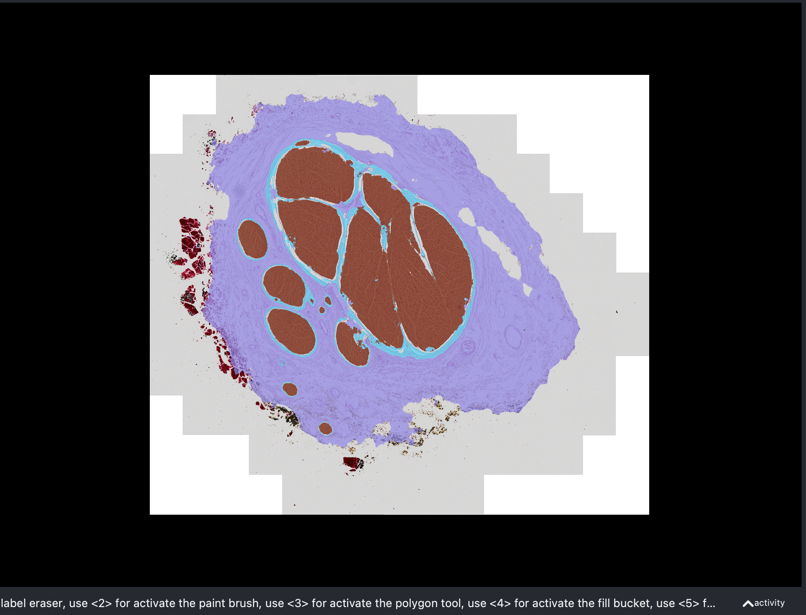
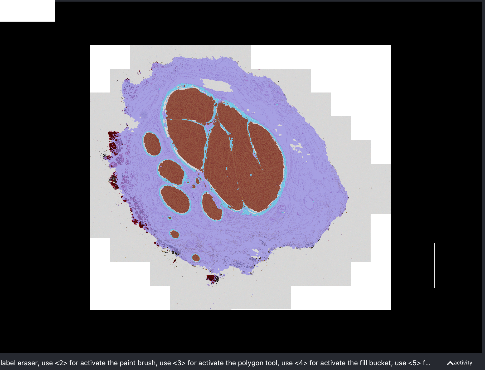

# ML-Histo-Nerve-Segmentation - Don't grade yet, even if gives 6% penalty will resubmit tonight/tomorrow

README.md
H&E Nerve Histology Segmentation with nnUNet

Final Project – Applied Machine Learning

# 0. Brief Term-list
Consider that throughout this project we will be using some light biological terminology. Consider the following:
1. Endoneurium - the region inside the nerve consisting of the axons
2. Perineurium - the relatively thin boundary between bundles of axons within nerves (encloses endoneurium)
3. Epineurium - the outer wall of the nerve (encloses both perineurium and endoneurium)
4. Fascicle - an individual bundle of axons within a nerve, any given nerve may have multiple or just one of these

# 1. What It Does

Consider that many cutting-edge research topics in the field of medicine currently are exploring the nervous system and specifically nerve morphology, itself a fast-growing field given relatively novel data collection methods. That being said, especially considering the growth in available data, it becomes important to be able to efficiently process these data, that is, glean the desired information as quickly and accurately as possible. This project attempts to accomplish this, specifically for H&E-stained histology images of cross sections of nerves in the carotid artery region of the human body. The project provides a deep learning pipeline for preprocessing the data, segmenting the cross section into the endoneurium, perineurium, and epineurium regions, as well as provides an error analysis of the predictions.

# 2. Quick Start
Prerequisites

Python 3.10

CUDA-enabled PyTorch (if running training)

nnU-Net v2 installed

Access to GPU cluster (recommended)

Environment Setup
conda create -n nnunet python=3.10 -y
conda activate nnunet
pip install nnunetv2

Set nnU-Net environment variables
export nnUNet_raw=/path/to/nnUNet_raw
export nnUNet_preprocessed=/path/to/nnUNet_preprocessed
export nnUNet_results=/path/to/nnUNet_results

Preprocess Dataset

Your dataset must live in:

$nnUNet_raw/Dataset920_HE/
    imagesTr/
    labelsTr/
    dataset.json

Then run:

nnUNetv2_plan_and_preprocess -d 920 -p nnUNetPlans

Train (Fold 0)
nnUNetv2_train 920 2d 0 --deterministic

Run Inference
nnUNetv2_predict -i ./inference_inputs \
                 -o ./predictions \
                 -d 920 -c 2d -f 0

Apply Postprocessing (optional)
python postprocess_clean.py predictions predictions_clean

# 3. Video Links

# 4. Evaluation

After training the model, I evaluated how well the model predicts the desired segmentations in the standard manner of evaluation of the DiCE score, as shown in the following tables. This was done specifically using the eval.py script included in the repository. Furthermore, the analysis was done both on the level of each segmentation class, as well as on average, to allow for better interpretation. Consider the mathematical equation of the score to be 

$$
\mathrm{Dice}(A, B) = \frac{2|A \cap B|}{|A| + |B| + \epsilon}
$$

for two possible segmentation labels $A$ and $B$, with $\epsilon$ small to avoid division by 0. 

## 4.1 Base Model Analysis

### nnUNet Base Model

| Structure           | Mean Dice | Std Dev  | Min     | Max     |
|--------------------|-----------|----------|---------|---------|
| **Background**      | 0.9850    | 0.0089   | 0.9639  | 0.9974  |
| **Endoneurium**     | 0.9870    | 0.0059   | 0.9662  | 0.9940  |
| **Perineurium**     | 0.9245    | 0.0240   | 0.8769  | 0.9576  |
| **Epineurium**      | 0.9709    | 0.0158   | 0.9312  | 0.9880  |
| **Mean Dice (No Bg)** | 0.9608 | 0.0107   | 0.9433  | 0.9754  |
| **Mean Dice (All)**   | 0.9668 | 0.0093   | 0.9510  | 0.9790  |

Observe that, at least quantitatively, the model appears to be doing very well at predicting the regions of interest desired to be segmented, with a fairly high mean DiCE, and relatively small standard deviation, indicating little variation throughout the predictions, reaffirmed by the min-max intervals also shown above. Notice that the Background, Endoneurium, and Epineurium segmentation classes appear to have been learned slightly better than the Perineurium class. Perhaps to be better informed by the qualitative (image) analysis, however, at a preliminary standpoint, the perineurium is known to be harder to concretely identify, especially defining the boundary between the endoneurium and itself, as well as the epinuerium and itself. Additionally, the perineurium can be much thinner than are the other regions desired to be segmented. Consider also that the standard deviation of the perineurium DiCE scores also indicated the most variation out of all the classes. 

Consider the following overlays depicting the model's predicted segmentation on the left, and the ground truth segmentation on the right, with endoneurium painted red, perineurium blue, and epineurium purple.

  
  

At first glance, as is suggested by the quantitative analysis, the segmentations do not look extremely different, however a deeper dive does reveal more about them. For instance, the image below zooms in to reveal some "holes" in the segmentation of the endoneurium, which should not occur. A possible reason for this is the stark difference in color sometimes seen within the endoneurium, as during the histology process, the dead axons naturally begin to separate from their bundles, revealing some gaps in the endoneurium. However, the ground truth segmentation does not reflect this as something desired to be captured, and thus, this might necessitate a fix in the future. 

    

Moreover, consider the following side-by-side of the model-predicted segmentation (left) and the original histology slide itself (right) zoomed in on the same lower left region of the previous image. Here we see the difficulty in distinguishing the endoneurium from the perineurium for the model. What is slightly interesting is that the model does not segment what I believe to be the entire region of doubt one singular segmentation class but rather "expresses" its uncertainty in its hedging between both classes. 

    
    

Additionally, depicted in the same format as above, we notice that the model has difficulty recognizing the presence of entire other nerve structures (perineurium enclosing endoneurium) in very close proximity to the larger perineurium structure. This is likely due to the proximity to the larger perinuerium structure coupled with the similarity in colors, however, this may also be a pitfall of the labeled data, since there is some subtlety in when and in what cases, small nerve structures such as these are treated as deserving of their own perineurium and endoneurium, or if they should simply be lumped together with the epineurium.

    
    

Additionally, we have that the model trained with the following metrics shown. Notice that it may appear as though the model is overfitting, the later studies show that this is not truly so, and the model is simply training well, also evidenced by the impressive statistics shown in the beginning.

    

## 4.2 Ablation Studies

As mentioned, the nnUNet framework utilizes a large amount of data augmentation techniques, one of those being the perturbation of the colors of the image in the training methods. Consider the following table demonstrating the DiCE sccores achieved when training without such techniques, specifically, observe that the scores do not drop that much, if at all. We again see that the endoneurium and epineurium segmentation classes are performing slightly better than the perineurium, however, this too is consistent with our base model. 

### nnUNet - Trained without Color Augmentation (Ablation)

| Structure             | Mean Dice | Std Dev  | Min     | Max     |
|----------------------|-----------|----------|---------|---------|
| **Background**        | 0.9846    | 0.0080   | 0.9669  | 0.9971  |
| **Endoneurium**       | 0.9861    | 0.0093   | 0.9489  | 0.9930  |
| **Perineurium**       | 0.9283    | 0.0201   | 0.8812  | 0.9623  |
| **Epineurium**        | 0.9705    | 0.0157   | 0.9313  | 0.9885  |
| **Mean Dice (No Bg)** | 0.9616    | 0.0089   | 0.9452  | 0.9755  |
| **Mean Dice (All)**   | 0.9674    | 0.0077   | 0.9546  | 0.9789  |

Looking closer at some sample images, consider the side-by-side of the segmentations produced by this trained model (left) and those produced by the original (right). We see pretty much the same effects as before, with the model struggling in some admittedly problematic areas, however, on the whole they look fairly similar. The only interesting factor is that there is not much of the holes in segmentation of the endoneurium as noted with the original model, which might make sense considering the perturbation of colors (or lack thereof) is what is being tested. 

  
  

What would make this model even more desireable is perhaps a speedup in the training, considering there are less augmentations taking place, however, we do not see this truly, as depicted by the very similar training metrics output.

    

Additionally, I also tested, as an ablation study, whether further downsampling the data had an impact on the performance of the model, as this would have allowed, I thought, better computational efficiency. Considering the reported DiCE scores however, we find that this trained model slightly underperformed in most of the segmentation classes, however not significanty. We again notice the perineurium segmentation class providing the most difficulty, perhaps further exacerbated by the loss of some resolution in training, causing it to be even harder to distinguish a small boundary. 

### nnUNet - Trained with Further Downsampled Data (x8) (Ablation)

| Structure             | Mean Dice | Std Dev  | Min     | Max     |
|----------------------|-----------|----------|---------|---------|
| **Background**        | 0.9710    | 0.0196   | 0.9037  | 0.9965  |
| **Endoneurium**       | 0.9465    | 0.0674   | 0.7060  | 0.9929  |
| **Perineurium**       | 0.8778    | 0.0481   | 0.7329  | 0.9585  |
| **Epineurium**        | 0.9440    | 0.0309   | 0.8680  | 0.9807  |
| **Mean Dice (No Bg)** | 0.9228    | 0.0411   | 0.7851  | 0.9617  |
| **Mean Dice (All)**   | 0.9348    | 0.0350   | 0.8148  | 0.9693  |

Consider also the comparison of segmentation outputs as compared between each of the models. From a wide view, it is evident that there are issues with the segmentation classes, specifically noting the holes apparent in epineurium class, as well as considerable spilling over of the perineurium segmentation class into the endoneurium and epineurium. On the whole, it seems that the downsampling by a further factor of 2 was certainly felt by the model and was thus not able to perform as well as other model configurations have done.    

  
  

Zooming into another prediction by this model (left), we notice the same spilling over effect as above, again with the perineurium segmentation class in regions solidly belonging to endoneurium. With this image specifically, it appears as though this might be explained by the edges of the endoneurium having a bit of a darker hue, thus appearing somewhat similar to the perineurium. However, comparing this to the prediction of the original model on this same image (right), we notice that it is possible for the model to achieve a better, more coherent segmentation. 

    
    

Further of note here is the slightly different traininng curves than other trained models. Consider the training loss curves for this model (left) as compared to those for the original trained model discussed (right). Notice specifically the growing gap between the training loss and validation loss curves, a telltale sign of overfitting. Thus, it appears as though the further downsampling might have led to the destruction of more discriminative features that the model could have learned. With too much downsampling, the model likely learned too many shortcuts within the dataset and thus began to overfit. Therefore, this is likely the cause of the poorer performance when testing the model on images outside of its training set. 

    
    

### nnUNet - Trained with Early Stopping (Ablation)

Finally, consider that the nnUNet model's training algorithm does include some regularization techniques such as weight decay, however, the training is initially set to continue for 1000 epochs with no stopping in betweeen. Thus, in order to determine if this was the best possible practice for the algorithm, I adapted my own training function that incorporated early stopping. Originally, I was planning to test against a number of patience factors, and thus, began with a very mild patience factor 50, that is stopping training only after validation loss hadn't improved in 50 epochs. 

Below are depicted the results of the model with this training algorithm. As is shown, at least quantitatively, it appears as though this model with early-stopping performed on par to the other models. However, to better truly gauge this, we may again qualitatively analyze the actual segmentation predictions.  

| Structure             | Mean Dice | Std Dev  | Min     | Max     |
|----------------------|-----------|----------|---------|---------|
| **Background**        | 0.9758    | 0.0097   | 0.9535  | 0.9943  |
| **Endoneurium**       | 0.9672    | 0.0161   | 0.9166  | 0.9839  |
| **Perineurium**       | 0.8225    | 0.0544   | 0.6841  | 0.9226  |
| **Epineurium**        | 0.9491    | 0.0197   | 0.8977  | 0.9758  |
| **Mean Dice (No Bg)** | 0.9129    | 0.0236   | 0.8649  | 0.9532  |
| **Mean Dice (All)**   | 0.9286    | 0.0184   | 0.8930  | 0.9592  |

  
  

Consider that there aren't many blatant differences between the segmentation predictions of the early-stopping model (left) and that of the original model (right). Though, again, looking deeper, we do find that the segmentation of the perineurium especially is very coarse, certainly not as smooth and delineated as in the original model's predictions. Consider that this is fairly well-represented by the image below of the model's prediction on a different image. Thus, while the early-stopping mechanism does often prevent overfitting for many models, even for such a modest patience as 50, it appears as though the model does continue to learn far into the 1000 epochs that it trains for. More to this point, it appears as though the learning of the boundaries between segmentations, might come later in the learning process.  

    

## 4.3 Out-of-Sample Testing

Since most histology data that will be used for the purpose of data collection and measurements in the true research process are relatively "clean," and easy to segment the dataset used for the training and testing of this model did not include any extraneous cases, however, they certainly do exist. In many slides, at the point of imaging, fascicles within the nerve being imaged have been broken, or, especially frequently, the perineurium will have ruptured. Thus, out of curiosity to see how the model performs with these such edge cases, specifically those of ruptured perinueria, I ran the model to predict segmentations for these images. One example is depicted below, the left depicting the segmentation overlay, and the right, the raw image:

    
    

Consider that in these cases, it is even ambiguous to experts what an accurate segmentation might look like, and thus, interpreting the results of the model, specifically in the area for which the perineurium is disconnected, we see that on the right, the perineurium is segemented (accurately) until the end, however, on the left, the perineurium segementation arbitrarily morphs into the epineurium's. Speculatively, this could be because the proximity of the perinuerium might have been growing too far from the segmentation of the endoneurium, which the model might have learned to associate with increased loss. Observing the other cases for which this ruptured perineurium problem occurs, the model again truncates the segmentation of the perineurium after some distance moving further from the endoneurium as well.  

    
    

